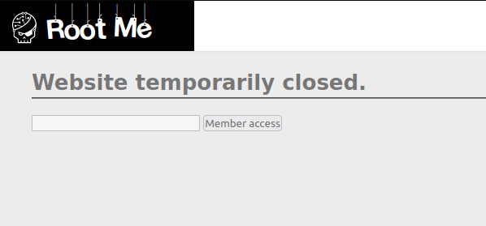
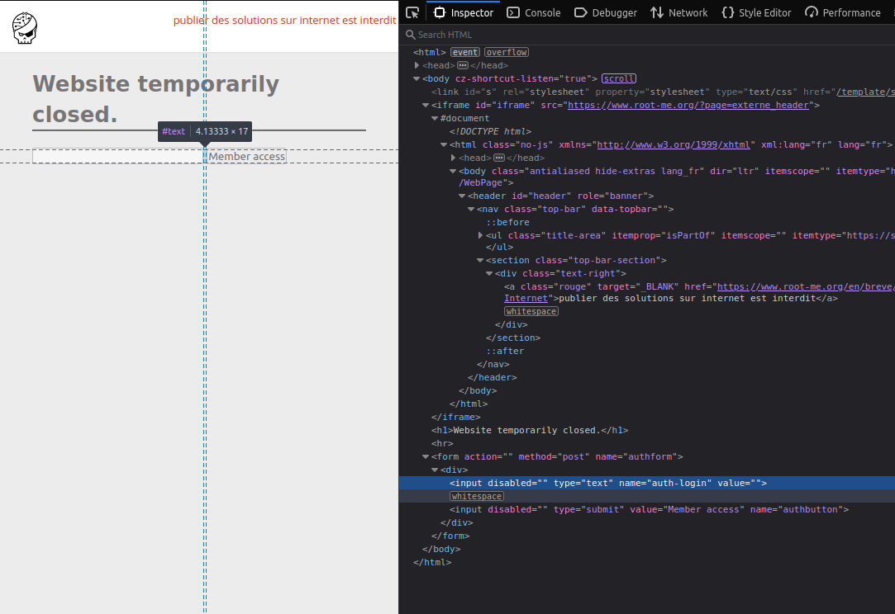
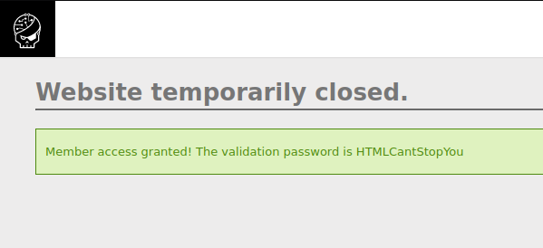

# **HTML - disabled buttons**
```bash
Author: _wiky
Date: 2023/04/25
```
## 1. Statement
This form is disabled and can not be used. It’s up to you to find a way to use it.



## 2. Sorting out
When I looked at the page, I thought about a HTML feature for form buttons - [**disabled**](https://www.w3schools.com/tags/att_button_disabled.asp) attribute. I tried disabling **disabled** feature using Developer Console (F12).



After trying deleting **disabled** attribute from the form input and button, I could fill **admin** and click on the Member access button and got the flag.



## Capture the flag
The flag is **HTMLCantStopYou**