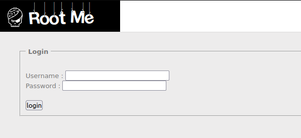
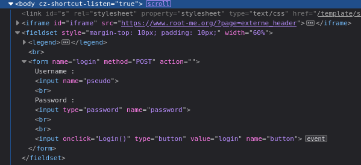
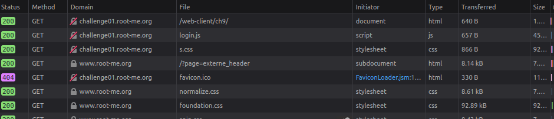
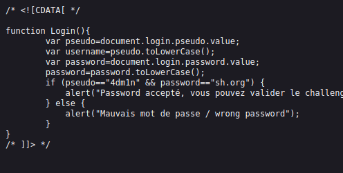

# **Javascript - Authentication**
```bash
Author: _wiky
Date: 2023/04/25
Difficult: Very Easy
```
## 1. Statement


## 2. Sorting out
At the first time, I hadn't have any idea about the form. I opened Developer Console(F12) to view html attributes and found that when I clicked on login button, the button would trigger a function named **Login()**.


Normally, the form data will transfer to Backend via **action** attribute or via Javascript. So I switched to Network tab to view all files the page loaded and found an interesting file named login.js.


Open the javascript file and I got the flag after analyzing code lines.


## 3. Capture the flag
The flag is **sh.org**