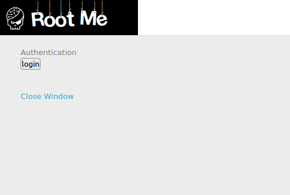
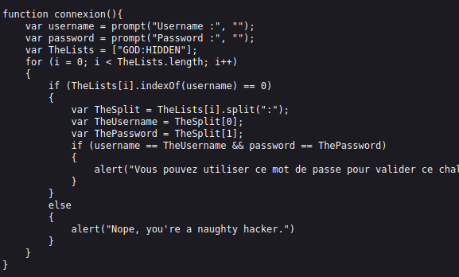

# **Javascript - Authentication 02**
```bash
Author: _wiky
Date: 2023/04/25
Difficult: Very Easy
```
## 1. Statement


## 2. Sorting out
This one is similar to [Javascript - Authentication](./javascript-authentication.md). I can easily find login.js via Developer Tool and solve an easy code problem.


## 3. Capture the flag
The flag is **HIDDEN**