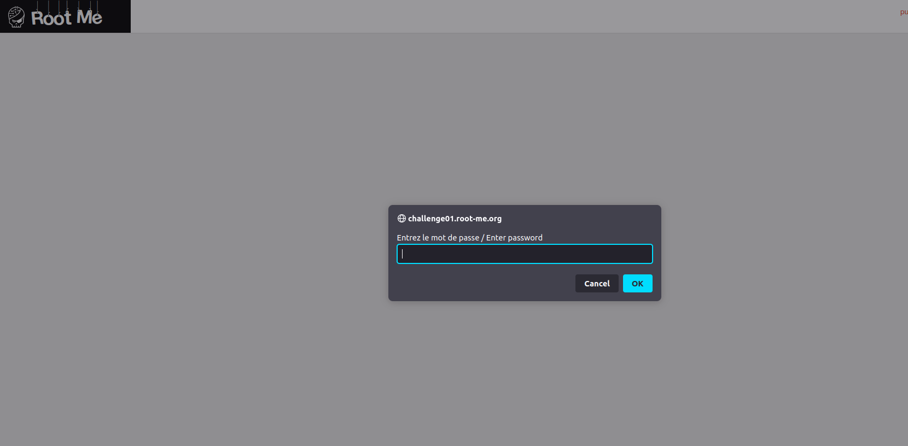
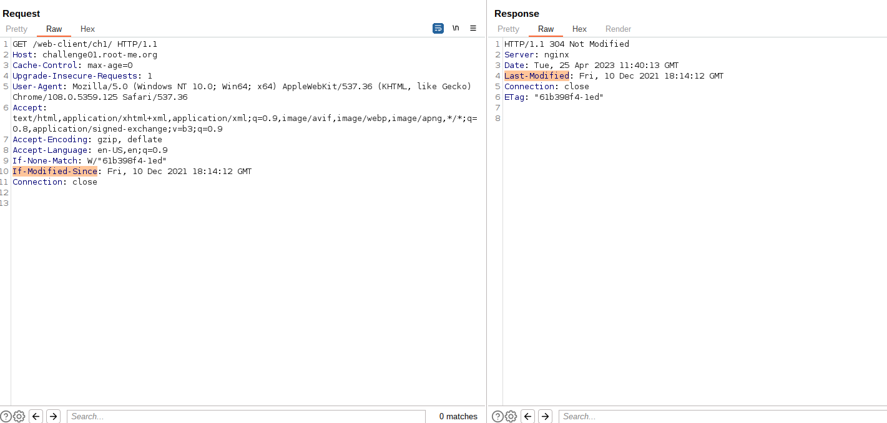
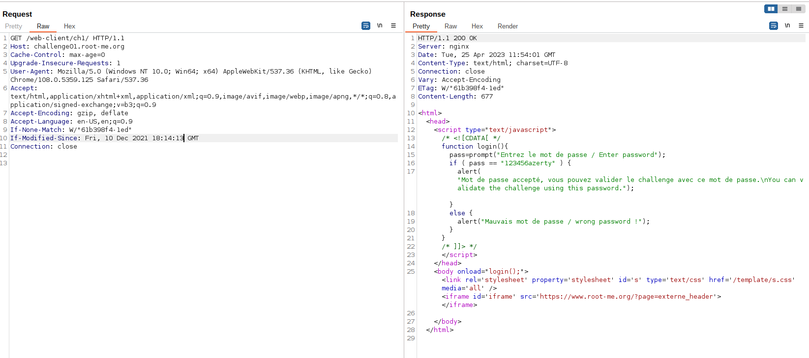

# **Javascript - Authentication**
```bash
Author: _wiky
Date: 2023/04/25
```
## 1. Statement


## 2. Sorting out
I basically checked with Developer Tool and Page Source and found nothing. I tried again with Burp Suite and recognized a supspicous header **If-Modified-Since** in the request. The response replied a header named **Last-Modified**. The two headers had the same value.


Refer to [RFC1945](https://repository.root-me.org/RFC/EN%20-%20rfc1945.txt), I found a clue as the following:
```bash
10.9  If-Modified-Since

   The If-Modified-Since request-header field is used with the GET
   method to make it conditional: if the requested resource has not been
   modified since the time specified in this field, a copy of the
   resource will not be returned from the server; instead, a 304 (not
   modified) response will be returned without any Entity-Body.

       If-Modified-Since = "If-Modified-Since" ":" HTTP-date

   An example of the field is:

       If-Modified-Since: Sat, 29 Oct 1994 19:43:31 GMT

   A conditional GET method requests that the identified resource be
   transferred only if it has been modified since the date given by the
   If-Modified-Since header. The algorithm for determining this includes
   the following cases:

      a) If the request would normally result in anything other than
         a 200 (ok) status, or if the passed If-Modified-Since date
         is invalid, the response is exactly the same as for a
         normal GET. A date which is later than the server's current
         time is invalid.

      b) If the resource has been modified since the
         If-Modified-Since date, the response is exactly the same as
         for a normal GET.

      c) If the resource has not been modified since a valid
         If-Modified-Since date, the server shall return a 304 (not
         modified) response.

   The purpose of this feature is to allow efficient updates of cached
   information with a minimum amount of transaction overhead.
```
As mentioned, if i changed **If-Modified-Since**'s value to a new value that is diffent to **Last-Modified**'s value from the response, the response will return result as a normal GET. I send the old request to Repeater in Burp Suite and BINGO!!! I got the flag.


## 3. Capture the flag
The flag is **123456azerty**